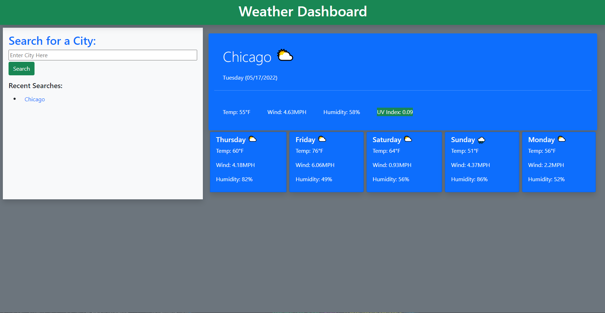

# Weather Dashboard

## Description  
This dashboard provides a clear view into the current weather condtions of a major city in the US, as well as a five day preview of what weather is to come. The search bar enables users to look for a city and immediately receives current and future conditions. Once the user submits info the page will automatically load the response. After a city is searched for, that city will be displayed in the "Recent Searches" section of the search box.

## Table of Contents  
[Description](#description)    
[Usage](#usage)  
[License](#license)   
[Tests](#tests)  
[Questions](#questions)  

## Usage  

[Link to Deployed App](https://colinmchale.github.io/WeatherDashboard/)

## License 
MPL 2.0
[Link to License](https://www.mozilla.org/en-US/MPL/2.0/)

## Tests  
The application can be tested by searching for a major city and seeing if the results are correct. Each search should also be displayed in the recent search list and should be able to be clicked on to render that city once again.

## Questions
Link to github: [Click Here](https://github.com/colinmchale)  
Please submit any additional questions you may have in an email to colin.mchale22@gmail.com
